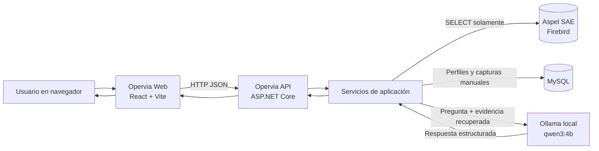

# Opervia

## Documentación completa del sistema

**Versión documental:** 1.0  
**Fecha de corte:** 31 de julio de 2026  
**Estado:** Sistema en desarrollo operativo  
**Audiencia:** Dirección, administración, ventas, cobranza, inventarios, soporte y desarrollo  
**Clasificación:** Uso interno

> Opervia consulta Aspel SAE en modo de solo lectura para convertir documentos y movimientos operativos en tableros comprensibles. La información administrativa que no existe en SAE se guarda de forma separada en MySQL y nunca se presenta como dato nativo de SAE.

---

## Control del documento

| Campo | Valor |
|---|---|
| Propietario funcional | Administración / Operaciones |
| Propietario técnico | Equipo responsable de Opervia |
| Aplicación documentada | Opervia Web + Opervia API |
| Base operativa | Aspel SAE 10 sobre Firebird |
| Persistencia auxiliar | MySQL |
| Inteligencia artificial activa | Ollama local, modelo `qwen3:4b` |
| Moneda de presentación | MXN |
| Idioma | Español (México) |

## Cómo mantener este documento

Actualice la fecha de corte y las secciones afectadas cuando cambie una fórmula, tabla SAE, ruta de API, dependencia, política de seguridad o comportamiento visible. No coloque contraseñas, claves API, rutas reales de bases ni datos personales en esta documentación.

---

## Contenido

1. Resumen ejecutivo
2. Alcance y principios
3. Arquitectura
4. Componentes y tecnologías
5. Fuentes de datos y trazabilidad
6. Seguridad y garantía de solo lectura
7. Instalación y configuración
8. Arranque y operación de servicios
9. Manual de usuario
10. Definiciones y fórmulas
11. Referencia de API
12. Persistencia MySQL
13. Inteligencia artificial
14. Calidad, pruebas y monitoreo
15. Solución de problemas
16. Respaldo y recuperación
17. Limitaciones y hoja de ruta
18. Glosario

---

# 1. Resumen ejecutivo

Opervia es una aplicación interna de inteligencia de procesos que consulta información de Aspel SAE 10 y la presenta en tableros visuales. Su propósito es ayudar a responder preguntas operativas sin modificar la base de datos de SAE:

- ¿Cómo se relacionan una cotización, un pedido, una remisión y una factura?
- ¿En qué etapa se detienen los documentos de venta?
- ¿Cuánto se facturó, cuánto se cobró realmente y cuánto se canceló?
- ¿Qué productos, vendedores, almacenes o líneas generan mayor utilidad?
- ¿Qué inventario está agotado, bajo, sobrado o sin movimiento?
- ¿Qué explican los datos de un expediente cuando el usuario pregunta a la IA?

La solución tiene cinco módulos funcionales activos:

| Módulo | Objetivo principal | Fuente |
|---|---|---|
| Centro de control | Reconstruir y explicar un flujo documental individual | SAE en vivo |
| Flujos de venta | Medir conversión, velocidad, cuellos de botella e integridad | SAE en vivo |
| Cuentas por cobrar | Separar facturación, ingresos reales, ajustes y cancelaciones | SAE en vivo |
| Rentabilidad | Analizar venta, costo, utilidad y margen | SAE en vivo + capturas manuales separadas |
| Inventario | Identificar productos ganadores, cobertura y riesgos | SAE en vivo |

Opervia no reemplaza la contabilidad ni los reportes oficiales de SAE. Es una capa analítica: organiza, cruza y explica información existente para facilitar decisiones.

---

# 2. Alcance y principios

## 2.1 Alcance funcional

El sistema cubre:

- conexión a una empresa SAE 10;
- persistencia segura de perfiles de conexión en MySQL;
- búsqueda individual de documentos de venta;
- reconstrucción del flujo hacia documentos anteriores;
- consulta de partidas y productos de cada documento;
- resumen agregado de flujos de venta;
- cobranza agregada e individual;
- rentabilidad comercial por periodo, sucursal y vendedor;
- análisis de inventario por periodo, vendedor, almacén y línea;
- selector global de importes con IVA o sin IVA;
- explicación asistida mediante un modelo local de IA;
- datos administrativos manuales separados de SAE.

## 2.2 Principios de diseño

1. **SAE es la fuente operativa.** Los tableros automáticos se calculan con datos leídos desde Firebird.
2. **Firebird es solo lectura.** La infraestructura Firebird contiene consultas `SELECT`; no contiene altas, cambios ni eliminaciones.
3. **MySQL es auxiliar.** Guarda perfiles de conexión y capturas manuales de Opervia; no copia ni corrige la operación de SAE.
4. **La procedencia debe ser visible.** Cada cálculo debe indicar si viene de SAE o de una captura manual.
5. **Los impuestos no se estiman dividiendo entre 1.16.** Se usan campos reales de SAE según el módulo.
6. **Los pagos no se convierten por IVA.** Un cobro es un movimiento monetario real y conserva su importe registrado.
7. **La IA no inventa consultas ni modifica datos.** Solo recibe la evidencia que el sistema ya recuperó.

## 2.3 Fuera de alcance actual

- escribir, corregir, cancelar o timbrar documentos dentro de SAE;
- modificar catálogos, existencias, saldos o movimientos Firebird;
- sustituir reportes fiscales o contables oficiales;
- autenticación, usuarios y permisos propios de Opervia;
- exportación formal a Excel o PDF desde la interfaz;
- actualización automática en segundo plano;
- módulos terminados de “Explorador” y “Configuración”.

---

# 3. Arquitectura

## 3.1 Vista general



El navegador nunca se conecta directamente a Firebird, MySQL u Ollama. Todas las operaciones pasan por la API.

## 3.2 Capas del código

| Proyecto | Responsabilidad |
|---|---|
| `Opervia.Domain` | Entidades y reglas básicas, como el perfil SAE y nombres de tabla por empresa |
| `Opervia.Application` | Contratos, modelos de respuesta y lógica de reconstrucción/clasificación |
| `Opervia.Infrastructure` | Consultas Firebird, persistencia MySQL y proveedores de IA |
| `Opervia.Api` | Endpoints HTTP, validaciones, CORS, límites y manejo de errores |
| `Opervia.Web` | Interfaz React, filtros, tableros y gráficas |
| `Opervia.Worker` | Esqueleto de proceso en segundo plano; no participa en los tableros actuales |
| `Opervia.Application.Tests` | Pruebas unitarias de reglas críticas |

## 3.3 Flujo de una consulta

1. El usuario selecciona o captura un perfil SAE.
2. La interfaz envía la petición y el perfil a la API.
3. La API valida formato, rango de fechas y destino permitido.
4. La capa de aplicación solicita la información requerida.
5. La infraestructura abre una conexión Firebird sin pooling y ejecuta `SELECT` parametrizados.
6. La aplicación calcula métricas y advertencias en memoria.
7. La API devuelve JSON y la interfaz lo transforma en indicadores y gráficas.
8. La respuesta HTTP se marca como `no-store`; no se conserva una copia de los datos operativos.

---

# 4. Componentes y tecnologías

## 4.1 Backend

- .NET 10 y ASP.NET Core.
- `FirebirdSql.Data.FirebirdClient` 10.3.4.
- `MySqlConnector` 2.6.1.
- OpenAPI disponible únicamente en desarrollo.
- ASP.NET Core Data Protection para proteger contraseñas guardadas.
- Rate limiting de 60 solicitudes por minuto por dirección IP.

## 4.2 Frontend

- React 19.2.
- TypeScript 6.
- Vite 8.
- React Flow para el diagrama de documentos.
- Lucide React para iconografía.
- CSS propio; no usa una librería externa de componentes.

## 4.3 Servicios auxiliares

- MySQL local en `127.0.0.1:3307` en la instalación de desarrollo.
- Ollama local en `127.0.0.1:11434`.
- Modelo configurado: `qwen3:4b`.

## 4.4 Puertos de desarrollo

| Servicio | Dirección predeterminada | Uso |
|---|---|---|
| Interfaz web | `http://localhost:5173` | Aplicación para el usuario |
| API HTTP | `http://localhost:5106` | Servicios JSON |
| API HTTPS | `https://localhost:7011` | Perfil alterno de desarrollo |
| MySQL | `127.0.0.1:3307` | Persistencia auxiliar |
| Ollama | `http://127.0.0.1:11434` | IA local |
| Firebird | Puerto 3050 por defecto | Lectura de SAE |

---

# 5. Fuentes de datos y trazabilidad

## 5.1 Regla de nombres por empresa

SAE agrega el número de empresa al nombre base de cada tabla. Por ejemplo, para la empresa `15`, `FACTF` se consulta como `FACTF15`. Opervia solo admite números de empresa formados por dígitos y nombres base alfanuméricos o con guion bajo.

## 5.2 Tablas SAE consultadas

| Tabla base | Contenido utilizado |
|---|---|
| `FACTC` | Encabezados de cotizaciones |
| `FACTP` | Encabezados de pedidos |
| `FACTR` | Encabezados de remisiones |
| `FACTF` | Encabezados de facturas, importes, estado y cancelación |
| `PAR_FACTC` | Partidas de cotizaciones |
| `PAR_FACTP` | Partidas de pedidos |
| `PAR_FACTR` | Partidas de remisiones |
| `PAR_FACTF` | Partidas de facturas, cantidades, precios, descuentos, costos e impuestos |
| `CLIE` | Nombre, razón comercial y RFC del cliente |
| `CUEN_M` | Cargo raíz de cuenta por cobrar |
| `CUEN_DET` | Aplicaciones, pagos, créditos y demás movimientos de cobranza |
| `CONC` | Catálogo y signo de conceptos de cuentas por cobrar |
| `INVE` | Productos, existencias globales, mínimos, máximos y costo promedio |
| `MULT` | Existencias por almacén |
| `VEND` | Catálogo de vendedores |
| `ALMACENES` | Catálogo de almacenes |
| `CLIN` | Catálogo de líneas de producto |
| `MINVE` | Se verifica durante la inspección de estructura; no alimenta los tableros actuales |

## 5.3 Datos que no vienen de SAE

Los gastos fijos, presupuestos, ajustes administrativos y gastos extraordinarios no se incorporan automáticamente a la rentabilidad. Si se capturan, se guardan en MySQL en una sección separada y no cambian la utilidad bruta calculada desde SAE.

## 5.4 Vigencia de la información

Las métricas de SAE se consultan en vivo cada vez que se actualiza un módulo. No existe un almacén analítico ni un caché de operación. El tiempo mostrado en milisegundos corresponde a la consulta procesada por la API.

---

# 6. Seguridad y garantía de solo lectura

## 6.1 Controles implementados

- Las clases de infraestructura Firebird usan `SELECT` y no contienen `INSERT`, `UPDATE`, `DELETE`, `MERGE`, procedimientos de escritura ni cambios de estructura.
- Las consultas variables usan parámetros; los nombres de tabla se construyen únicamente con un número de empresa validado.
- La contraseña Firebird no se coloca en archivos de configuración del frontend.
- Al guardar un perfil, la contraseña se protege mediante ASP.NET Core Data Protection antes de escribirla en MySQL.
- En entornos distintos de Development, la API solo acepta hosts y puertos incluidos en la lista permitida.
- La API agrega `X-Content-Type-Options: nosniff`, `X-Frame-Options: DENY`, `Referrer-Policy: no-referrer` y `Cache-Control: no-store`.
- Las llamadas SAE están limitadas a 60 solicitudes por minuto por IP.
- La interfaz usa `credentials: omit` y `referrerPolicy: no-referrer`.

## 6.2 Qué sí se modifica

Opervia escribe exclusivamente en su MySQL auxiliar cuando el usuario:

- guarda, actualiza o elimina un perfil de conexión;
- agrega o elimina una captura manual de rentabilidad.

Estas acciones no abren ni modifican Firebird.

## 6.3 Recomendaciones obligatorias para producción

1. Crear en Firebird una cuenta dedicada con permisos efectivos de solo lectura. La ausencia de SQL de escritura en el código es una protección importante, pero la defensa más fuerte debe existir también en la base.
2. Publicar la API únicamente dentro de la red privada, VPN o proxy corporativo.
3. Incorporar autenticación y autorización antes de exponer el sistema a más usuarios.
4. Configurar `SaeConnectionSecurity:AllowedHosts` y `AllowedPorts`; no habilitar destinos arbitrarios.
5. Configurar `Cors:AllowedOrigins` con la URL exacta de la interfaz.
6. Persistir y respaldar el almacén de claves de Data Protection. Si se pierde, las contraseñas guardadas pueden quedar imposibles de descifrar.
7. No registrar cuerpos completos de petición ni cadenas de conexión.
8. Restringir MySQL a `127.0.0.1` o a una red de aplicación controlada.

## 6.4 Estado actual de autenticación

La API registra servicios de autorización, pero actualmente no configura un mecanismo de autenticación ni aplica `[Authorize]` a los controladores. Por lo tanto, el control de acceso depende de la red local. Esta es una limitación conocida y debe resolverse antes de una publicación amplia.

---

# 7. Instalación y configuración

## 7.1 Requisitos

- Windows con acceso de red al servidor Firebird de SAE.
- .NET SDK 10.
- Node.js 22.12 o posterior.
- MySQL 8 compatible; la instalación local existente usa Docker.
- Ollama para Windows y el modelo `qwen3:4b`.
- Credenciales Firebird con lectura sobre la empresa SAE.

## 7.2 Preparar el backend

Desde `D:\Proyectos\Opervia`:

```powershell
dotnet restore Opervia.slnx
dotnet build Opervia.slnx --no-restore
```

Configure MySQL con .NET User Secrets. Use credenciales propias; no copie secretos al repositorio:

```powershell
dotnet user-secrets set "OperviaStorage:ConnectionString" "Server=127.0.0.1;Port=3307;Database=opervia;User ID=USUARIO;Password=CONTRASEÑA;" --project src\Opervia.Api
```

## 7.3 Preparar el frontend

```powershell
Set-Location D:\Proyectos\Opervia\src\Opervia.Web
npm ci
npm run build
```

La interfaz usa `http://localhost:5106` como API si no existe `VITE_API_URL`. Para otro entorno, defina la variable durante la compilación o ejecución de Vite.

## 7.4 Preparar Ollama

```powershell
ollama pull qwen3:4b
ollama list
```

En la instalación actual los modelos se dirigen a `D:\OllamaModels` mediante `scripts\start-ollama-local.cmd`.

## 7.5 Configuración principal de la API

| Sección | Propiedad | Descripción |
|---|---|---|
| `Cors` | `AllowedOrigins` | Orígenes web autorizados |
| `SaeConnectionSecurity` | `AllowArbitraryTargetsInDevelopment` | Permite cualquier host solo en desarrollo |
| `SaeConnectionSecurity` | `AllowedHosts` | Servidores Firebird permitidos fuera de desarrollo |
| `SaeConnectionSecurity` | `AllowedPorts` | Puertos Firebird permitidos; 3050 por defecto |
| `OperviaStorage` | `ConnectionString` | Cadena de MySQL; debe ser un secreto |
| `Ollama` | `Endpoint` | Endpoint local `/api/chat` |
| `Ollama` | `Model` | Modelo local usado por Opervia AI |

Ejemplo de variables de producción:

```text
SaeConnectionSecurity__AllowedHosts__0=servidor-sae.interno
SaeConnectionSecurity__AllowedPorts__0=3050
Cors__AllowedOrigins__0=https://opervia.empresa.example
```

## 7.6 Datos de conexión SAE solicitados

- Nombre descriptivo del perfil.
- IP o nombre del servidor.
- Puerto Firebird.
- Ruta local vista por el servidor Firebird o alias registrado.
- Usuario y contraseña Firebird.
- Número de empresa.
- Versión SAE, actualmente fija en 10.
- Juego de caracteres, normalmente UTF8.

No use una ruta compartida UNC. La ruta debe existir desde la perspectiva del servidor Firebird.

---

# 8. Arranque y operación de servicios

## 8.1 Secuencia recomendada

Abra terminales separadas.

**Terminal 1: MySQL**

```powershell
docker start opervia-mysql
```

**Terminal 2: Ollama**

```powershell
Set-Location D:\Proyectos\Opervia
scripts\start-ollama-local.cmd
```

**Terminal 3: API**

```powershell
Set-Location D:\Proyectos\Opervia
dotnet run --project src\Opervia.Api --launch-profile http
```

**Terminal 4: Web**

```powershell
Set-Location D:\Proyectos\Opervia\src\Opervia.Web
npm run dev
```

Abra `http://localhost:5173`.

## 8.2 Verificación rápida

- La interfaz debe cargar en el puerto 5173.
- La API debe anunciar `http://localhost:5106`.
- En desarrollo, `http://localhost:5106/openapi/v1.json` debe responder.
- `ollama list` debe mostrar `qwen3:4b`.
- `docker ps` debe mostrar `opervia-mysql` activo.
- El pie lateral debe mostrar el perfil SAE configurado después de seleccionarlo.

## 8.3 Detención

- Presione `Ctrl+C` en las terminales de Web, API y Ollama.
- Ejecute `docker stop opervia-mysql` si desea detener MySQL.
- Cerrar el navegador no detiene los servicios.

## 8.4 Worker

`Opervia.Worker` no es necesario para ejecutar la aplicación actual. Solo registra un mensaje periódico y debe considerarse una base para futuras tareas programadas.

---

# 9. Manual de usuario

## 9.1 Inicio y selección de conexión

1. Abra Opervia.
2. Entre a **Conexiones SAE**.
3. Seleccione un perfil guardado o capture uno nuevo.
4. Pulse **Usar esta conexión**.
5. Verifique el nombre y la empresa en la parte inferior izquierda.

El primer uso guarda el perfil en MySQL. La contraseña se almacena protegida. Al volver a abrir la página, Opervia intenta restaurar el perfil usado más recientemente.

> El botón actual guarda/activa el perfil; no ejecuta primero una prueba independiente. La conectividad queda comprobada al realizar la primera consulta. La API sí dispone de un endpoint técnico de prueba.

## 9.2 Selector global de IVA

En la parte inferior de la barra lateral se encuentra **Importes de factura**:

- **Con IVA:** muestra el total fiscal registrado en SAE.
- **Sin IVA:** muestra el subtotal o venta neta calculada con campos SAE.

La selección se conserva en `localStorage` del navegador y se aplica a Centro de control, Flujos, Cuentas por cobrar, Rentabilidad e Inventario. Los pagos reales no cambian al alternar este selector.

## 9.3 Centro de control

### Objetivo

Reconstruir el expediente de un documento específico y revisar su secuencia, cliente, importes, partidas y alertas.

### Uso

1. Escriba el número completo del documento.
2. El prefijo inicial determina el tipo: `C` cotización, `P` pedido, `R` remisión, `F` factura.
3. Pulse buscar.
4. Revise los indicadores de documentos, documento inicial, advertencias y tiempo.
5. Seleccione un nodo del diagrama para abrir sus partidas.
6. Use **Ver expediente** para revisar información disponible del flujo.
7. Escriba una pregunta en Opervia AI cuando exista un flujo real.

### Reconstrucción

Opervia comienza con el documento buscado, sigue `TIP_DOC_ANT` y `DOC_ANT`, y retrocede hasta encontrar el origen o un dato faltante. Después invierte el resultado para mostrarlo cronológicamente. El recorrido admite hasta 12 documentos, detecta ciclos y compara las referencias anterior/siguiente entre nodos.

### Integridad de datos

La calificación mostrada es una señal visual de Opervia, no un campo de SAE:

```text
Integridad = 100 - (12 × advertencias) - (8 × documentos con importe o fecha faltante)
```

El resultado mínimo es 0. Las advertencias incluyen referencias no recíprocas, cambio de cliente, tipo anterior desconocido, ciclo o límite de recorrido.

### Partidas

El panel de partidas muestra producto, descripción, cantidad, precio, costo, descuentos, almacén, impuestos y total por línea. Los importes se obtienen de las tablas `PAR_FACTC`, `PAR_FACTP`, `PAR_FACTR` o `PAR_FACTF` según el tipo.

## 9.4 Flujos de venta

### Objetivo

Analizar el proceso completo sin repetir el expediente individual.

### Filtros

- 30, 90 o 180 días;
- fecha inicial y final;
- vendedor.

El periodo máximo es de 367 días.

### Indicadores

- documentos totales, vigentes y cancelados por etapa;
- importe activo con o sin IVA;
- conversión entre cotización, pedido, remisión y factura;
- días promedio de transición;
- documentos sin avanzar después de 7 días;
- etapas saltadas;
- referencias rotas.

### Reglas importantes

- La conversión usa todos los documentos fuente vigentes del periodo, incluso los creados el mismo día; no existe periodo de gracia.
- Las cotizaciones con menos de 7 días y sin pedido se muestran como dato informativo, pero ya forman parte del porcentaje.
- Se considera que un documento avanzó cuando un documento destino vigente declara al primero como antecedente.
- Para pedido, la cola acepta como siguiente etapa una remisión o una factura.
- La consulta amplía internamente la lectura 180 días hacia atrás y hacia adelante para validar vínculos; los indicadores siguen limitados al periodo elegido.
- Solo se muestran los 18 cuellos de botella con mayor espera.

### Interpretación

Una conversión baja no prueba por sí sola un error: puede reflejar documentos abiertos, procesos saltados o referencias incompletas. Las referencias rotas y etapas saltadas son alertas de calidad que deben verificarse en el contexto operativo.

## 9.5 Cuentas por cobrar

### Panorama del periodo

Use los accesos **Este mes**, **30 días** o **Este año**, o seleccione un rango. El máximo es 367 días.

### Filtros comerciales

- vendedor;
- serie;
- folio inicial y final;
- clave exacta de cliente;
- almacén;
- estado vigente o cancelado;
- método fiscal PUE/PPD;
- forma o concepto de ingreso.

Los filtros de factura se aplican a pagos mediante el número de factura que SAE relaciona. Un movimiento sin factura asociada aparece únicamente en la vista sin filtros.

### Indicadores principales

- **Facturación vigente:** facturas emitidas en el periodo cuyo estado actual no es cancelado.
- **Ingresos reales:** movimientos reductores clasificados como entrada monetaria por fecha de aplicación.
- **Cancelaciones reales:** facturas cuya fecha efectiva de cancelación cae dentro del periodo.
- **Reducciones sin ingreso:** devoluciones, créditos, anticipos aplicados y otras disminuciones.
- **Cobrado vs. facturado:** comparación simple del ingreso real del periodo contra la facturación vigente del periodo.

> El porcentaje cobrado contra facturado es una comparación de flujos, no una conciliación uno a uno. Los pagos del periodo pueden corresponder a facturas emitidas en otro periodo.

### Cómo se calcula la facturación vigente, explicado paso a paso

**Qué responde este indicador:** cuánto dinero representan las facturas emitidas en el periodo seleccionado que actualmente siguen siendo documentos válidos, es decir, que no están canceladas.

Opervia realiza los siguientes pasos:

1. Lee los encabezados de factura de `FACTF{empresa}`. Por ejemplo, para la empresa 15 utiliza `FACTF15`.
2. Revisa `FECHA_DOC`, que es la fecha de emisión de la factura, y conserva únicamente los documentos emitidos dentro del rango seleccionado.
3. Revisa `STATUS`. Si su valor es `C`, la factura está cancelada y se excluye. Cualquier otro estado se considera vigente para este indicador.
4. Si el usuario eligió **Con IVA**, toma `ABS(IMPORTE)`, que es el total fiscal guardado por SAE.
5. Si eligió **Sin IVA**, calcula `ABS(CAN_TOT - DES_TOT)`, es decir, subtotal menos descuento general.
6. Suma una sola vez el encabezado de cada factura. No suma las partidas para este indicador, evitando duplicar el total por cada producto facturado.

Ejemplo:

| Factura | Fecha de emisión | Estado actual | Total con IVA | ¿Forma parte de la suma? |
|---|---|---|---:|---|
| F-001 | Dentro del periodo | Vigente y pagada | $11,600 | Sí |
| F-002 | Dentro del periodo | Cancelada | $5,800 | No |
| F-003 | Dentro del periodo | Vigente y pendiente | $9,280 | Sí |
| F-004 | Fuera del periodo | Vigente | $3,480 | No |

En este ejemplo, la facturación vigente con IVA es **$20,880**. Que F-001 ya esté pagada no la elimina: continúa siendo una venta válida. El cobro se analiza por separado.

**“Vigente” no significa “pendiente de cobro”.** Una factura vigente puede estar pagada, parcialmente pagada, vencida o pendiente. Este indicador mide ventas facturadas válidas, no cartera pendiente ni dinero recibido.

Los filtros de vendedor, serie, folio, cliente, almacén y método fiscal se aplican sobre la factura. El rango de fechas siempre utiliza la emisión (`FECHA_DOC`), no la fecha del pago, del vencimiento ni de la cancelación.

### Cómo se calculan los ingresos reales, explicado paso a paso

**Qué responde este indicador:** cuánto dinero fue registrado por SAE como cobro durante el periodo seleccionado. No toma la fecha en que se emitió la factura; toma la fecha en que se aplicó el movimiento de cobranza.

Opervia realiza los siguientes pasos:

1. Lee los movimientos de cuentas por cobrar en `CUEN_DET{empresa}` y sus conceptos en `CONC{empresa}`.
2. Filtra por `FECHA_APLI`, la fecha de aplicación del movimiento. Esta fecha debe caer dentro del periodo seleccionado.
3. Determina si el movimiento reduce la deuda. Primero utiliza `CUEN_DET.SIGNO`; si el signo no está disponible o vale cero, utiliza `CONC.SIGNO`. Solamente continúa cuando el signo efectivo es negativo.
4. Clasifica el concepto. Efectivo, transferencia, depósito, tarjeta, cheque y otros conceptos monetarios reconocidos se clasifican como **Ingreso real**.
5. Suma `ABS(CUEN_DET.IMPORTE)` para que el pago se presente como una cantidad positiva, aunque contablemente reduzca el saldo.
6. Las notas de devolución, notas de crédito y aplicaciones de anticipos se separan como **Reducciones sin ingreso**. Reducen la deuda, pero no representan dinero nuevo recibido.

Ejemplo:

| Movimiento aplicado en el periodo | Importe | Clasificación | ¿Se suma como ingreso real? |
|---|---:|---|---|
| Transferencia | $10,000 | Pago monetario | Sí |
| Pago con tarjeta | $5,000 | Pago monetario | Sí |
| Nota de crédito | $2,000 | Reducción sin ingreso | No |
| Aplicación de anticipo | $1,000 | Reducción sin ingreso | No |
| Transferencia con fecha futura | $3,000 | Aún no vigente | No, hasta llegar su fecha |

En este ejemplo, los ingresos reales son **$15,000**, aunque la cartera haya disminuido $18,000. Los otros $3,000 redujeron la deuda mediante crédito o anticipo, no mediante dinero nuevo.

Los ingresos reales **no cambian** al alternar Con IVA/Sin IVA: un pago es el importe efectivamente aplicado en SAE y no se recalcula como si fuera una factura.

Cuando se aplican filtros comerciales, Opervia relaciona `CUEN_DET.NO_FACTURA` con `FACTF.CVE_DOC`. Por eso un pago puede filtrarse por vendedor, serie, cliente o almacén de la factura relacionada. Si un movimiento no contiene una factura relacionada, solamente aparece al consultar sin esos filtros.

### Por qué facturación vigente e ingresos reales pueden ser diferentes

Los dos indicadores usan relojes distintos:

- **Facturación vigente:** fecha de emisión de la factura (`FECHA_DOC`).
- **Ingresos reales:** fecha de aplicación del pago (`FECHA_APLI`).

Por ejemplo, una factura emitida en diciembre y pagada en enero no forma parte de la facturación de enero, pero su pago sí forma parte de los ingresos reales de enero. Del mismo modo, una factura emitida en enero y pagada en febrero aparece en la facturación de enero y en los ingresos de febrero.

Por esta razón, que los ingresos reales sean mayores o menores que la facturación vigente del mismo periodo no constituye por sí solo un error. Para comprobar una factura específica debe utilizarse el expediente individual de cobranza.

### Estudio de gráficas

El usuario puede seleccionar:

- facturación por vendedor;
- facturación por serie;
- facturación por almacén;
- facturación PUE vs. PPD;
- facturas vigentes vs. canceladas;
- ingresos por forma de pago;
- ajustes que no son ingreso.

Cada análisis admite ranking horizontal, columnas o dona, medición por importe o cantidad y límites Top 5, 8 o 12.

### Expediente individual

Busque una factura, referencia o documento. Opervia localiza el cargo raíz en `CUEN_M`, consulta aplicaciones en `CUEN_DET` y obtiene actividad reciente del cliente.

Muestra:

- cargo original con o sin IVA;
- saldo calculado si SAE devuelve signos;
- vencimiento y días de atraso;
- último movimiento negativo;
- antigüedad de cargos del cliente;
- ficha del cargo y UUID;
- movimientos vinculados;
- actividad reciente del cliente.

El saldo individual se calcula como la suma de `importe × signo`. Se usa el signo del movimiento y, si falta, el signo del concepto. Si SAE no entrega signos utilizables, el saldo se marca como no disponible.

La antigüedad agrupa cargos positivos en: por vencer, 1–30, 31–60, 61–90 y más de 90 días. Es informativa y no sustituye el reporte contable.

## 9.6 Rentabilidad comercial

### Objetivo

Mostrar ventas, costo de venta, utilidad bruta y margen con datos automáticos de SAE.

### Filtros

- fecha inicial y final, hasta tres años;
- sucursal;
- vendedor.

### Indicadores

- venta neta sin IVA;
- venta con IVA/impuestos;
- costo de venta SAE;
- utilidad bruta sin IVA;
- margen bruto;
- diferencia fiscal;
- cantidad de facturas;
- ticket promedio sin IVA;
- evolución mensual;
- distribución por sucursal o vendedor.

### Clasificación de sucursales

Actualmente la sucursal se infiere mediante prefijos de factura y, como respaldo, número de almacén:

| Regla | Sucursal |
|---|---|
| `F-QR8...` o almacén 8 | CDMX |
| `F-HT...`, `HT0...` | Huasteca |
| `F-XA...`, `F-EX...`, `QRX...` | Xalapa |
| `F-SL...`, `F-ES...`, `SL2...` | SLP |
| `F-QR...`, `F-EQ...`, `QR5...` o almacén 4 | QRO |
| almacén 7 | GTO |
| Sin coincidencia | Sin clasificar |

Estas reglas están codificadas y deben actualizarse cuando cambien las series o sucursales.

### Capturas manuales

La sección permite registrar fecha, categoría, importe y nota. Los valores:

- se guardan en MySQL;
- se muestran por separado;
- no se suman ni restan de la utilidad bruta automática;
- no modifican Firebird.

## 9.7 Inventario inteligente

### Filtros

- 30, 90 o 180 días;
- rango personalizado, máximo 367 días;
- vendedor;
- almacén;
- línea de producto.

### Indicadores

- productos activos;
- productos con venta en el periodo;
- valor de inventario positivo a costo promedio;
- productos bajo mínimo;
- productos agotados que sí tuvieron demanda;
- valor de inventario dormido.

### Productos ganadores

El ranking puede ordenarse por utilidad bruta, ventas, unidades o margen. La API prepara hasta 300 productos únicos combinando los mejores 100 por utilidad, ventas, unidades y margen —este último solo para productos con venta sin IVA de al menos $1,000—.

### Comparación configurable

Agrupe por línea, vendedor o almacén y mida utilidad, venta, unidades o valor de inventario. El valor de inventario no está disponible por vendedor porque el stock no pertenece a una persona comercial.

### Riesgos

| Riesgo | Regla | Severidad |
|---|---|---|
| Agotado con demanda | Existencia ≤ 0 y cantidad vendida > 0 | Crítica |
| Bajo mínimo | Existencia > 0 y ≤ mínimo configurado | Alta |
| Sobrestock | Existencia > máximo configurado | Media |
| Dormido | Existencia y valor > 0, sin última venta o última venta hace 90 días o más | Media |

Se devuelven hasta 30 prioridades, ordenadas por severidad y valor comprometido.

### Velocidad y cobertura

- Velocidad mensual = unidades vendidas × 30 / días del periodo.
- Cobertura en días = existencia / (unidades vendidas / días del periodo).
- La cobertura solo existe si hay venta y existencia positiva.

## 9.8 Opervia AI

Opervia AI aparece en el Centro de control después de reconstruir un flujo. La IA recibe:

- la pregunta del usuario;
- la etiqueta de la empresa activa;
- el flujo ya recuperado;
- las partidas del documento seleccionado, si están abiertas.

No recibe acceso directo a Firebird ni ejecuta SQL. La pregunta admite hasta 1,000 caracteres. La respuesta contiene explicación, resumen, alertas y preguntas sugeridas.

## 9.9 Accesos de reserva

Los botones **Explorador** y **Configuración** aparecen en la navegación, pero todavía no cambian a una vista funcional. Deben tratarse como marcadores de módulos futuros.

---

# 10. Definiciones y fórmulas

## 10.1 Importes con y sin IVA

El selector no aplica una división genérica. Usa estas bases:

| Módulo | Sin IVA | Con IVA |
|---|---|---|
| Flujo documental | `CAN_TOT - DES_TOT` | `IMPORTE` |
| Cuentas por cobrar | `ABS(CAN_TOT - DES_TOT)` | `ABS(IMPORTE)` |
| Rentabilidad | suma de partidas `CANT × PREC × (1 - DESC1/100)` | suma de `ABS(FACTF.IMPORTE)` |
| Inventario | cantidad × precio con descuentos secuenciales `DESC1`, `DESC2`, `DESC3` | venta neta de partida + `TOTIMP1...TOTIMP8` |
| Pago real | No cambia | No cambia |

## 10.2 Rentabilidad

```text
Venta neta sin IVA = Σ [cantidad × precio × (1 - descuento 1)]
Costo de venta = Σ [cantidad × costo de la partida]
Utilidad bruta = venta neta sin IVA - costo de venta
Margen bruto % = utilidad bruta / venta neta sin IVA × 100
Ticket promedio = venta neta sin IVA / número de facturas
```

Solo se incluyen facturas cuyo `STATUS` no es `C`.

> Diferencia técnica conocida: Inventario aplica `DESC1`, `DESC2` y `DESC3` de forma secuencial; Rentabilidad aplica actualmente solo `DESC1`. Debe homologarse o justificarse antes de usar ambos módulos como conciliación contable exacta.

## 10.3 Inventario

```text
Valor de stock = máximo(existencia, 0) × costo promedio
Venta sin IVA = cantidad × precio × (1-DESC1) × (1-DESC2) × (1-DESC3)
Venta con impuestos = venta sin IVA + TOTIMP1 + ... + TOTIMP8
Costo = cantidad × costo de partida
Utilidad = venta sin IVA - costo
Margen % = utilidad / venta sin IVA × 100
```

Se excluyen productos dados de baja y elementos de tipo servicio.

## 10.4 Facturación y cancelaciones

- Facturación bruta: todas las facturas emitidas en el periodo, incluyendo las que hoy están canceladas.
- Facturación vigente: facturas emitidas en el periodo con `STATUS` distinto de `C`.
- Documentos del lote cancelados: facturas emitidas en el periodo cuyo estado actual es `C`.
- Cancelaciones reales del periodo: facturas con `STATUS = C` y `FECHA_CANCELA` dentro del periodo, aunque la emisión haya ocurrido antes.

## 10.5 Clasificación de reducciones de cartera

Primero se seleccionan movimientos con signo efectivo negativo. Se usa `CUEN_DET.SIGNO`; si está vacío o es cero, se usa `CONC.SIGNO`.

| Clasificación | Conceptos numéricos configurados | Palabras de respaldo |
|---|---|---|
| Ingreso real | 9, 10, 11, 15, 22, 23, 24, 1003 | EFECTIVO, TRANSFER, DEPOSITO, PAGO TDC, PAGO TDD, TARJETA, CHEQUE CERTIF, CODI |
| Devolución o crédito | 8, 12, 26, 1001, 1002 | DEVOL, NOTA CRED, NOTA DE CRED, BONIFIC |
| Anticipo aplicado | 17, 25 | APLIC ANTICIPO, APLIC. ANTICIPO, SALDO A FAVOR |
| Otra reducción | Todo lo demás | Sin coincidencia |

Los conceptos personalizados de la empresa deben revisarse periódicamente. Un concepto no reconocido se conserva como “Otra reducción” para evitar presentarlo como ingreso real.

## 10.6 Cobrado vs. facturado

```text
Cobrado vs. facturado % = ingresos reales aplicados en el periodo
                           / facturación vigente emitida en el periodo × 100
```

No representa el saldo de las mismas facturas salvo que ambos conjuntos coincidan por fecha y vínculo.

## 10.7 Estado del expediente individual

- Liquidada: existen signos y el saldo calculado es ≤ $0.01.
- Vencida: la fecha de vencimiento ya pasó y no se clasifica como liquidada.
- Por vencer: vence dentro de los próximos 7 días.
- Vigente: existe cargo y no entra en las categorías anteriores.
- Sin determinar: faltan datos suficientes.

---

# 11. Referencia de API

Todas las rutas SAE reciben el perfil y la contraseña en el cuerpo JSON. La API responde en JSON y aplica el límite global de 60 solicitudes/minuto/IP.

## 11.1 Conexiones

| Método y ruta | Descripción |
|---|---|
| `GET /api/connections` | Lista perfiles guardados sin contraseña |
| `GET /api/connections/last-used` | Recupera el perfil usado más recientemente |
| `GET /api/connections/{id}/use` | Recupera y marca un perfil como usado |
| `POST /api/connections` | Guarda o actualiza un perfil en MySQL |
| `DELETE /api/connections/{id}` | Elimina un perfil de MySQL |
| `POST /api/connections/sae/test` | Prueba conectividad Firebird |
| `POST /api/connections/sae/inspect-schema` | Verifica tablas esperadas |
| `POST /api/connections/sae/inspect-table/{tableName}` | Consulta metadatos de columnas |

## 11.2 Documentos y flujos

| Método y ruta | Descripción |
|---|---|
| `POST /api/sae/documents/latest/{kind}` | Recupera documentos recientes de un tipo |
| `POST /api/sae/document-lookup/{kind}/{number}` | Busca un encabezado exacto |
| `POST /api/sae/document-items/{kind}/{number}` | Obtiene partidas |
| `POST /api/sae/sales-flow/{kind}/{number}` | Reconstruye el flujo individual |
| `POST /api/sae/sales-flow/summary?from=&to=&seller=` | Resume el proceso de ventas |

`kind` admite `Quotation`, `Order`, `Delivery` o `Invoice`.

## 11.3 Cuentas por cobrar

| Método y ruta | Descripción |
|---|---|
| `POST /api/sae/receivables/root/{number}` | Localiza el cargo raíz |
| `POST /api/sae/receivables/{number}` | Localiza movimientos vinculados |
| `POST /api/sae/receivables/customer/{code}/recent` | Obtiene actividad reciente del cliente |
| `POST /api/sae/receivables/summary` | Calcula panorama financiero y opciones de filtro |

Parámetros del resumen: `from`, `to`, `seller`, `series`, `folioFrom`, `folioTo`, `customer`, `warehouse`, `status`, `fiscalMethod` y `paymentConcept`.

## 11.4 Rentabilidad e inventario

| Método y ruta | Descripción |
|---|---|
| `POST /api/sae/profitability?from=&to=&branch=&seller=` | Calcula rentabilidad comercial |
| `POST /api/sae/inventory/analytics?from=&to=&seller=&warehouse=&line=` | Calcula desempeño y riesgos de inventario |

## 11.5 Datos manuales e IA

| Método y ruta | Descripción |
|---|---|
| `GET /api/manual-profitability-entries?from=&to=&branch=` | Lista capturas manuales |
| `POST /api/manual-profitability-entries` | Agrega una captura manual |
| `DELETE /api/manual-profitability-entries/{id}` | Elimina una captura manual |
| `POST /api/ai/ask` | Pregunta a la IA con evidencia del flujo |

## 11.6 Códigos y errores

- `200`: consulta correcta.
- `201`: captura manual creada.
- `204`: eliminación correcta o sin último perfil.
- `400`: datos o rango inválidos.
- `403`: destino Firebird no autorizado.
- `404`: perfil o captura inexistente.
- `429`: límite de solicitudes excedido.
- `500`: error interno sin detalle sensible.
- `503`: IA local no configurada o no disponible.

---

# 12. Persistencia MySQL

## 12.1 Tabla `sae_connection_profiles`

Se crea automáticamente al primer uso.

| Campo | Propósito |
|---|---|
| `id` | Identificador GUID |
| `fingerprint` | SHA-256 de host, puerto, base, usuario y empresa para evitar duplicados |
| `display_name` | Nombre visible |
| `host_name`, `port` | Destino Firebird |
| `database_path` | Ruta o alias |
| `user_name` | Usuario Firebird |
| `protected_password` | Contraseña protegida, no texto plano |
| `company_number` | Sufijo de tablas SAE |
| `sae_version`, `charset_name` | Compatibilidad |
| `created_at_utc`, `updated_at_utc`, `last_used_at_utc` | Auditoría básica |

Guardar el mismo destino actualiza nombre, contraseña, versión y charset mediante la huella única.

## 12.2 Tabla `manual_profitability_entries`

| Campo | Propósito |
|---|---|
| `id` | Identificador GUID |
| `entry_date` | Fecha administrativa |
| `category` | Tipo de captura |
| `branch_name` | Sucursal opcional |
| `amount` | Importe positivo |
| `note` | Explicación opcional, hasta 500 caracteres |
| `created_at_utc` | Fecha de creación |

## 12.3 Política de datos

MySQL no almacena facturas, partidas, clientes, pagos, inventarios ni respuestas de IA. Almacena configuración y datos manuales propios de Opervia.

---

# 13. Inteligencia artificial

## 13.1 Proveedor activo

La inyección de dependencias conecta `IOperviaAiAssistant` con `OllamaOperviaAssistant`. Aunque existe una implementación para OpenAI en el código, no está registrada como proveedor activo y no se usa automáticamente.

## 13.2 Privacidad

La petición se envía al endpoint local de Ollama. En la configuración predeterminada no sale a Internet ni genera costo por consulta. La evidencia puede contener números de documento, cliente, RFC, importes y partidas, por lo que el equipo que ejecuta Ollama debe mantenerse protegido.

## 13.3 Comportamiento esperado

- temperatura 0;
- contexto máximo solicitado de 8,192 tokens;
- respuesta JSON estructurada;
- instrucción de usar únicamente la evidencia;
- advertir faltantes, cancelaciones y diferencias;
- no sugerir escrituras ni SQL sobre Firebird;
- tiempo máximo HTTP de tres minutos.

## 13.4 Límites

La IA no puede contestar “cualquier cosa sobre toda la base” en el estado actual. Solo conoce el flujo y las partidas que la interfaz le entrega. Para preguntas empresariales amplias se necesita una capa adicional de herramientas analíticas seguras que produzca evidencia agregada antes de preguntar al modelo.

---

# 14. Calidad, pruebas y monitoreo

## 14.1 Validaciones recomendadas

```powershell
Set-Location D:\Proyectos\Opervia
dotnet restore Opervia.slnx
dotnet build Opervia.slnx --no-restore
dotnet test Opervia.slnx --no-restore

Set-Location src\Opervia.Web
npm ci
npm run lint
npm run build
```

Estas pruebas no requieren abrir Firebird.

## 14.2 Cobertura unitaria actual

- validación del número de empresa y nombre de tabla;
- reconstrucción ordenada de flujos;
- detección de ciclos;
- documento inicial inexistente;
- detección de filtros de cobranza;
- clasificación de pagos, devoluciones, anticipos y pagarés.

## 14.3 Registros

La API registra fallas de consultas, errores no controlados y solicitudes inválidas. No existe todavía un tablero de salud, auditoría funcional ni almacenamiento centralizado de logs.

## 14.4 Lista de revisión de una liberación

- Compilación backend correcta.
- Pruebas unitarias correctas.
- Lint y compilación frontend correctos.
- Verificación de que no hay secretos en Git.
- Revisión de reglas de sucursal y conceptos de pago.
- Prueba con perfil Firebird de solo lectura.
- Confirmación de CORS, hosts y puertos permitidos.
- Respaldo de MySQL y claves de Data Protection.
- Prueba visual de los cinco módulos.

---

# 15. Solución de problemas

## 15.1 La página no abre

1. Confirme que Vite sigue activo.
2. Abra `http://localhost:5173`.
3. Revise que el puerto no esté ocupado.
4. Si el frontend compiló pero no carga datos, revise la API.

## 15.2 La API no responde

1. Confirme `dotnet run --project src\Opervia.Api --launch-profile http`.
2. Revise `http://localhost:5106/openapi/v1.json` en Development.
3. Verifique que `VITE_API_URL` no apunte a una dirección antigua.
4. Revise el registro de excepciones de la API.

## 15.3 MySQL no está disponible

Síntoma: no cargan perfiles guardados o capturas manuales.

- Ejecute `docker start opervia-mysql`.
- Verifique el puerto 3307.
- Confirme `OperviaStorage:ConnectionString` en User Secrets.
- No coloque la contraseña en `appsettings.json`.

## 15.4 Firebird no conecta

- Verifique IP/nombre, puerto 3050, VPN y firewall.
- Confirme que la ruta sea local para el servidor Firebird o un alias válido.
- Revise usuario, contraseña, empresa y charset.
- En producción, confirme que el host esté en `AllowedHosts`.
- Use el endpoint técnico de prueba si se requiere diagnóstico controlado.

## 15.5 No se encuentra una factura o su flujo

- Capture el número completo, incluida serie y ceros.
- Confirme que comience con C, P, R o F.
- Verifique que la empresa seleccionada sea correcta.
- Si el documento existe pero el flujo está incompleto, revise `TIP_DOC_ANT` y `DOC_ANT` en el origen mediante personal autorizado; Opervia no los corrige.
- Una advertencia de referencia no significa que Opervia modificó la base; significa que detectó una relación no recíproca.

## 15.6 No aparecen pagos

- Confirme que el pago tenga fecha de aplicación dentro del periodo.
- Revise si `CUEN_DET` relaciona el movimiento con `NO_FACTURA`.
- Confirme que el signo efectivo sea negativo.
- Revise que el concepto esté clasificado como ingreso real.
- Los movimientos sin factura vinculada desaparecen cuando se aplican filtros de factura.
- Los movimientos con fecha futura se muestran como anomalía y no se incluyen todavía.

## 15.7 El saldo individual aparece “No disponible”

SAE no devolvió un signo utilizable en el movimiento ni en el concepto. Opervia evita inferir un saldo sin esa evidencia.

## 15.8 La IA no responde

- Ejecute `ollama list` y confirme el modelo.
- Inicie `scripts\start-ollama-local.cmd`.
- Verifique el puerto 11434.
- Espere hasta tres minutos en equipos con recursos limitados.
- La falla de IA no afecta las consultas SAE ni altera datos.

## 15.9 Respuesta HTTP 429

La IP superó 60 solicitudes en un minuto. Espere al siguiente intervalo y evite actualizaciones repetidas o varias pestañas consultando a la vez.

---

# 16. Respaldo y recuperación

## 16.1 Qué respaldar

- volumen MySQL `opervia_mysql_data`;
- base y usuario MySQL de Opervia;
- almacén de claves ASP.NET Core Data Protection;
- configuración de producción sin incluirla en Git;
- este repositorio y sus etiquetas/versiones;
- instalación/modelos de Ollama si se desea evitar una descarga posterior.

Opervia no realiza ni administra respaldos de Firebird. El respaldo de SAE continúa bajo el procedimiento oficial de la empresa.

## 16.2 Recuperación mínima

1. Restaure MySQL.
2. Restaure las mismas claves de Data Protection.
3. Configure nuevamente variables y secretos.
4. Inicie MySQL, Ollama, API y Web.
5. Pruebe un perfil sin editar la información de SAE.
6. Ejecute la batería de compilación y pruebas.

Si se restaura MySQL sin las claves de Data Protection, elimine y vuelva a crear los perfiles de conexión con las contraseñas correctas.

---

# 17. Limitaciones y hoja de ruta

## 17.1 Limitaciones conocidas

| Prioridad | Limitación | Impacto |
|---|---|---|
| Alta | Sin autenticación/roles propios | Cualquier usuario con acceso de red a la API puede consultar |
| Alta | La cuenta Firebird no se obliga desde código a ser solo lectura | La garantía final depende también de permisos de base |
| Alta | Rentabilidad usa solo `DESC1`; Inventario usa `DESC1–3` | Puede haber diferencias entre módulos |
| Media | Clasificación de conceptos usa reglas fijas y texto | Conceptos personalizados requieren mantenimiento |
| Media | Clasificación de sucursal está codificada | Nuevas series/almacenes pueden quedar sin clasificar |
| Media | La IA solo conoce el expediente cargado | No responde todavía sobre todo SAE de manera autónoma |
| Media | Sin caché o almacén histórico | Consultas amplias dependen del rendimiento Firebird |
| Media | Sin pruebas de integración contra una copia anonimizada | Los cambios de esquema SAE se detectan en ejecución |
| Baja | Explorador y Configuración son marcadores | No ofrecen funcionalidad actual |
| Baja | `WeatherForecast` es un endpoint de plantilla | Debe retirarse antes de producción |
| Baja | Worker es un esqueleto | No aporta procesamiento productivo |

## 17.2 Recomendaciones de evolución

1. Autenticación corporativa y roles por módulo/empresa.
2. Cuenta Firebird dedicada de solo lectura y auditoría de permisos.
3. Homologación certificada de todas las fórmulas de venta e impuesto.
4. Catálogo configurable de conceptos de cobranza.
5. Catálogo configurable de sucursales, series y almacenes.
6. Health checks para API, MySQL, Ollama y conectividad SAE.
7. Exportaciones controladas a Excel/PDF y bitácora de generación.
8. Pruebas de integración con respaldo Firebird anonimizado y no productivo.
9. Herramientas seguras de IA para consultas agregadas en todos los módulos.
10. Observabilidad centralizada, métricas de duración y alertas.
11. Eliminación de endpoints y proyectos de plantilla no utilizados.

---

# 18. Glosario

| Término | Definición |
|---|---|
| SAE | Aspel Sistema Administrativo Empresarial |
| Firebird | Motor de base de datos usado por SAE en esta instalación |
| Perfil SAE | Host, puerto, ruta/alias, usuario, empresa, versión y charset |
| Flujo documental | Secuencia cotización → pedido → remisión → factura |
| Documento vigente | Documento cuyo estado no es cancelado |
| Cancelación real | Cancelación cuya fecha efectiva cae en el periodo analizado |
| Ingreso real | Movimiento reductor clasificado como entrada monetaria |
| Reducción no monetaria | Aplicación que reduce cartera sin representar dinero nuevo |
| Venta sin IVA | Subtotal o venta neta calculada desde campos SAE |
| Utilidad bruta | Venta sin IVA menos costo de venta |
| Margen bruto | Utilidad bruta como porcentaje de la venta sin IVA |
| Cobertura | Días estimados que puede durar la existencia a la velocidad observada |
| Inventario dormido | Existencia con valor y sin venta reciente por 90 días o más |
| PUE/PPD | Método fiscal de pago en una sola exhibición o en parcialidades/diferido |
| Data Protection | Mecanismo de ASP.NET Core usado para proteger secretos persistidos |

---

## Cierre

Opervia está diseñado para hacer visible la operación registrada en SAE sin intervenirla. Las decisiones deben apoyarse en la trazabilidad mostrada, validar las excepciones con las áreas responsables y conservar siempre la separación entre datos automáticos de SAE, cálculos derivados de Opervia y capturas manuales de MySQL.
